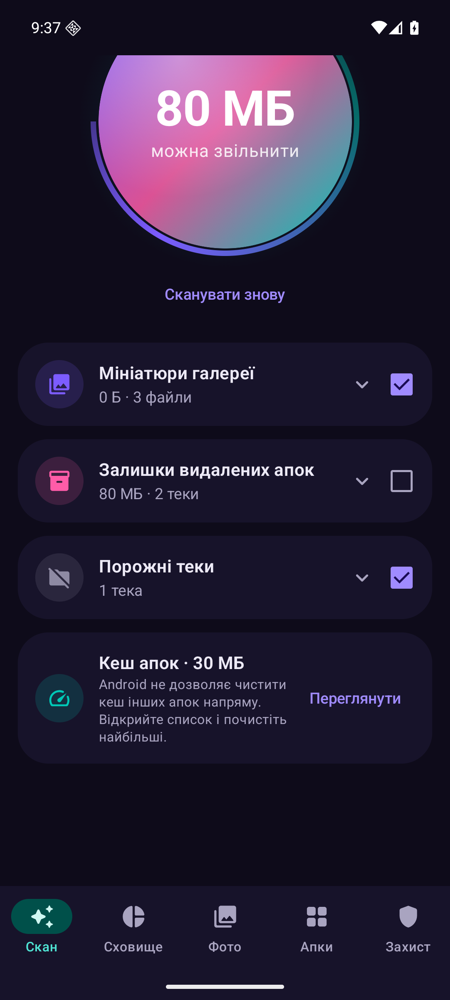
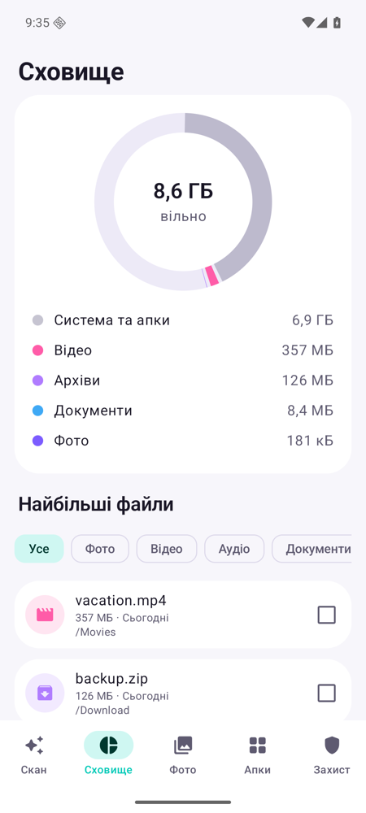
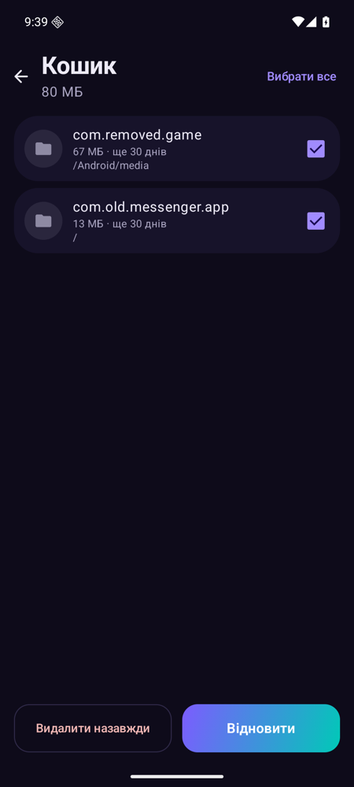

<p align="center">
  
</p>

<h1 align="center">Androcleaner</h1>

<p align="center">
  Чесний клінер для Android — як CleanMyMac, але для телефона.<br/>
  Без реклами. Без трекерів. Без «у вас 99+ вірусів».
</p>

<p align="center">
  
  
  
</p>

---

## Що вміє

- **Smart Scan** — мініатюри галереї, тимчасові файли й логи, старі APK (з позначкою «вже встановлено»), залишки видалених апок, порожні теки.
- **Кеш апок** — очищення кешу всіх апок: через [Shizuku](https://shizuku.rikka.app/), автоматично через Спеціальні можливості (версія Full) або через системне вікно Android.
- **Фото** — схожі кадри й серії (залишаємо найчіткіший), розмиті фото, старі скріншоти, свайп-режим «залишити / видалити».
- **Дублікати** — точні копії будь-яких файлів (порівняння за вмістом).
- **Захист** — хто має доступ до спецможливостей, SMS, сповіщень, камери, мікрофона; апки не з магазину; перевірка APK через VirusTotal і MalwareBazaar з вашим безкоштовним ключем (надсилаються лише SHA-256 хеші).
- **Сховище** — діаграма зайнятого місця і найбільші файли.
- **Апки** — розмір, кеш, давно не відкривані, швидке видалення.
- **Кошик** — ваші файли спершу потрапляють у кошик Androcleaner і зберігаються 30 днів.

## Принципи

1. Працює офлайн. Мережа — лише для VirusTotal / MalwareBazaar, і тільки якщо ви додали свій ключ.
2. Нічого не видаляється без підтвердження.
3. Жодних «прискорювачів RAM» — це плацебо.
4. Без нотифікацій, які ви не вмикали.

## Встановлення

Потрібен Android 11+. Завантажте APK з [Releases](../../releases/latest). Є дві версії:

| Файл | Що вміє | Як ставити |
|---|---|---|
| `Androcleaner-v*.apk` | усе, кеш апок чиститься через системне вікно Android | просто відкрийте APK |
| `Androcleaner-Full-v*.apk` | сам натискає «Очистити кеш» для кожної апки | за інструкцією нижче |

Обидві мають однаковий підпис і ставляться одна поверх одної без втрати даних.

### Як встановити Full, поки апки немає в F-Droid

Full використовує Спеціальні можливості, тому Play Захист блокує її встановлення з браузера
(«Додаток заблоковано, щоб захистити ваш пристрій»). Це загальне правило Google для таких апок, а не ознака вірусу —
код відкритий, перевірте самі.

1. Відкрийте **Play Маркет** → ваш аватар угорі праворуч → **Play Захист**.
2. Натисніть ⚙ (угорі праворуч) → вимкніть **«Сканувати додатки за допомогою Play Захисту»** → **Призупинити**.
3. Відкрийте завантажений `Androcleaner-Full-v*.apk` і встановіть.
4. Поверніться в Play Захист і знову ввімкніть сканування.
5. В Androcleaner натисніть «Очистити» біля кешу апок → **Увімкнути**. Якщо перемикач служби сірий:
   **Налаштування → Додатки → Androcleaner → ⋮ (угорі праворуч) → Дозволити обмежені налаштування**, потім увімкніть знову.

Або з компʼютера через USB-налагодження:

```bash
adb install Androcleaner-Full-v0.2.1.apk
```

Після появи в F-Droid ці кроки стануть непотрібні.

## Збірка

Потрібні JDK 21 та Android SDK (compileSdk 37).

```bash
./gradlew assembleStandardDebug assembleFullDebug
```

## Дозволи

| Дозвіл | Навіщо |
|---|---|
| Доступ до всіх файлів | пошук сміття, дублікатів, великих файлів |
| Статистика використання | розмір кешу апок, давно не використовувані апки |
| Список апок | аналіз встановлених апок, перевірка APK |
| Видалення апок | кнопка «Видалити» |

## Ліцензія

[GPL-3.0](LICENSE)
